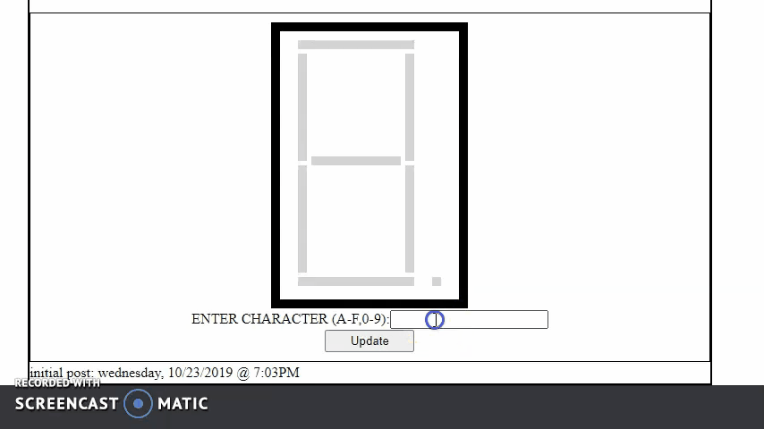

# seven_segment
Emulation of a seven segment display.  

## 11/10/2019 10:09AM
Looked up a datasheet for a seven segment display to get information about 
their implementation. It looks like I'll be doing a common anode display (only just learning what that means).
To start I'm just trying to get something on the screen by building the 
basic class structure and defining the methods/functions that draw the body
of the display to the canvas element. This first commit was me testing whether 
my vision of the model is valid, the `Seven_segment` class' `init_display()`
method calls the _private_ function `draw_display()` that draws the 'segments'
to the canvas in their respective positions. One of the things this first commits tests out
is the validity of the data model of each of the segments. To begin, I will implement 
the segements such that they may be simply be turned on and off by calling a method, 
passing in a value to represent. However, the ultimate goal is to generalize the model 
into an actual emulation of the real-life component, exposing its pins and their states 
as the mechanism for controlling the display. I'm not sure how far I'll take this, 
possibly to actually emulating the flow of electricity and voltages. I do intend to 
implement a BCD encoder/decoder (not sure of the correct terminology yet) chip and 
driver to control it so I may revise the model as I go, generalizing it as necessary.
The hardest part so far has been getting something on the 'paper'. I had a bit of confusion 
with using `for( in )` in the form of not understanding what exactly was returned when 
iterating over a JS object, turns out its the key, only just the key, not the object even if
the key points to an object as I assumed. Once I had that sorted, I was on my way. I'm 
attempting to make the drawing operations as exstensible as possible, storing the lengths 
and widths of the segments as constants and making each segment a separate object. This 
will likely be generalized by defining a segment class and simply instantiating the segments with
their own values in a future version. Right now, I just needed the verbosity of this iteration 
to help me get started :smile:
## 11/10/2019 7:30PM
First iteration done! :tada: The page consists of a textbox and a button to submit values to be displayed.
Right now, __it only accepts hexadecimal values (capital letters)__. I know that 7 segments are capable of 
many more than that, but that's as far as I got today. Some cleanup of the `seven_segment_display_with decimal`
class will be necessary as I've left some bits (such as the code for the text box and button and what-not) in 
the class that really belong in something like an `app.js` file in order to leave the display file clean and 
standalone as a reuseable component. I'm happy with what I've accomplished today, I was pretty sure I'd fail when
I started. :laughing: Going forward, I want to obviously implement all the possible characters, but I likely won't 
do so as I intend to go forward with building the rest of the circuit to make it a full emulation; the BCD encoder/
decoder will be resposible for turning on and off segments so the sort of hardcoded implementation I have in the 
form of the `_char_dictionary` array won't be necessary. This depends on how far I decide to actually take the emulation,
I have to keep in mind that it is an emulation and simulating electric current, though it sounds fun, may get unnecessarily
tedious as my ultimate goal is an emulation of a vintage computer system, which one I'm not sure yet. Right now, it's seeming
liek it'll be the PDP-11, but for sure one with a CPU composed of discrete components and with enough documentation available in 
the form of books or PDF scans of old manuals online. Coming back to the present program, I ran into some difficulty with 
getting input from the textbox and utilizing the `_char_dictionary` array. At first, I attempted to use a `<form>` and its 
associated `onsubmit` behavior to handle getting the value of the textbox. After wrangling around for an hour, I realized 
I was better off getting rid of the form and just using a separate `<input>` field and a regular `<button>`, setting 
ad event listener on the button. After getting the input i intended to just compare the value with the keys of `_char_dictionary`
and set `_pin_array` to point to the array stored at that key. The problem was that at that point the `state` property of 
each segment was still holding a reference to the orginal `_pin_array`, so the state remained the same as it was upon 
initialization. I finally thought of having the `state` property return the value of `_pin_array` from a function which 
eliminates the standing reference to `_pin_array`, ensuring that when called I get the value as it is at that instant, 
meaning, after the `_update()` function has set it to represent the proper character. Fun TiMeS! I may go back and attempt
to stylize the segments a bit more by placing them at an angle. According to the datasheet for the model I referenced, the
angle is 10 degrees. From some reading I've learned that the angle is for readibility. Implementing this will likely require 
using paths instead of the simple `strokeRect()` context method. I could probably define my own method that draws a polygon, accepts an angle, and does some math to put it on screen. We'll see.
Looking forward to the next component!

